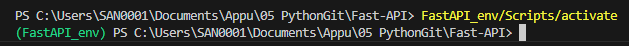
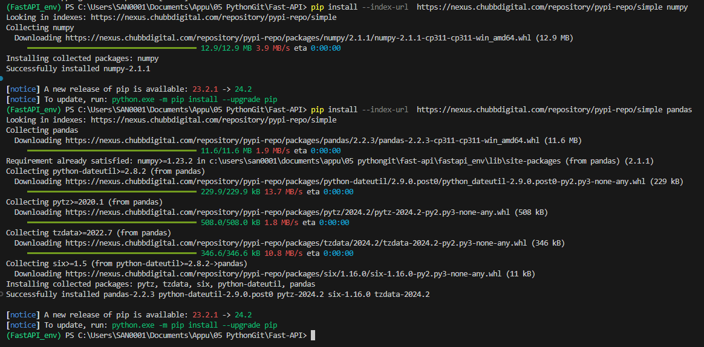

# Fast-API
Refer : https://youtube.com/playlist?list=PLZoTAELRMXVPgsojPOHF9i0u2L83-m9P7&amp;si=3yc_H4u3Im4BgWBc

### Introduction
* ML models when deployed to cloud --> Flask framework was used. 
* Flask framework - can deploy, create frontend, create an API and expose it to the frontend application.

### FastAPI
Refer : https://fastapi.tiangolo.com/

* FastAPI - also a framework like Flask and Django. Actually, its better. Django is huge & covers a lot of functionalities (downside - huge) which is addressed by FastAPI. Flask has very less number of features so FastAPI is better than Flask too. So its like:  
<--- Flask (Light weight) -------------- FastAPI ------------------- Django (Heavy) ---->  
* FastAPI is a modern, fast (high-performance), web framework for building APIs with Python based on standard Python type hints.
* Its fast due to a property called [ASGI](https://asgi.readthedocs.io/en/latest/) (Asynchronous Server Gateway Interface). Flask and Django use [WSGI](https://wsgi.readthedocs.io/en/latest/what.html) (Web Server Gateway Interface). Difference between ASGI and WSGI is that ASGI is Asynchronous & WSGI is Synchronous. 
* FastAPI uses [Pydantic](https://docs.pydantic.dev/latest/) - Data Validation and settings management using python type annotations. Hence, it enforces type hints at runtime and provides user friendly errors when data is invalid.
    - From the front end we want to send parameters and do a post request. While doing a post request using using the requests library, I can capture the values coming in the post. Similarly, this library does the work of the request object itself and apart from that it has additional functionalities. 
* FastAPI also uses Starlette
* Swagger - a json schema. Now known as OpenAPI. If JSON Schema given as a XML file, it can be loaded and we can see the different APIs there. 
* Has a similar code to Flask.

### uvicorn
* used for the ASGI server implementation.

<b>Kite</b> - nice extension that provides suggestions - can be integrated with VSCode, Spyder, etc.

#### Virtual Environment details
  
Activating the virtual environment: FastAPI_env
  
Trying to deactivate the virtual environment :

#### Installations:
  
Installing pandas and numpy: 
  

#### The FastAPI app 
* Refer main.py ; It's just another flask application.
* Only difference, it uses uvicorn to run the FastAPI application by applying ASGI.

#### Running the FastAPI app file
Let's say you have your FastAPI app in a file called `main.py` and the app is initialized as  `app=FastAPI()`. Then the following is how you deploy / run your FastAPI app -
`uvicorn main:app --reload`

#### FastAPI - docs page {a functionality by Swagger}
This is a functionality provided by FastAPI where you needn't create your frontend pages to test your API's get functionality. Instead, this page will list the number of `GET` endpoints that your app contains. You just need to provide the respective values in the respective fields and check the output for yourself. 

#### FastAPI - redoc {a functionality by OpenAPI}
Another page / functionality thats same as your docs page. 

### ML Application
Dataset : [Bank Note Authentication UCI Data](https://www.kaggle.com/datasets/ritesaluja/bank-note-authentication-uci-data)
1 - real bank note, 0 - false note. 

### Asynchronous and Synchronous (differences and details)

<----- Notes ----->

